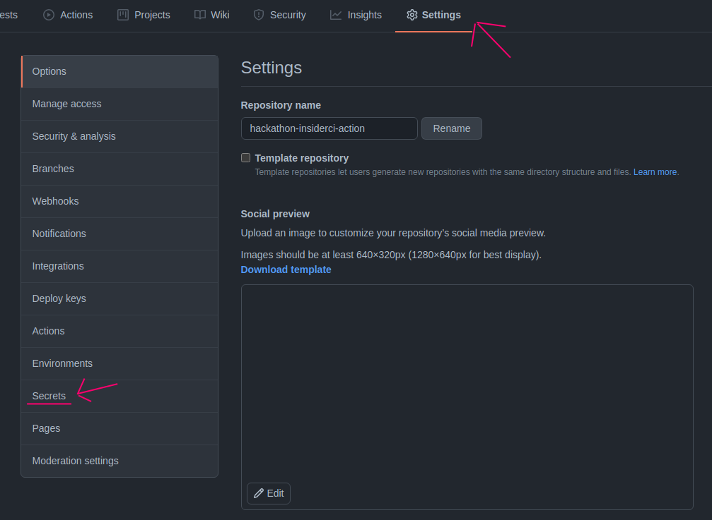
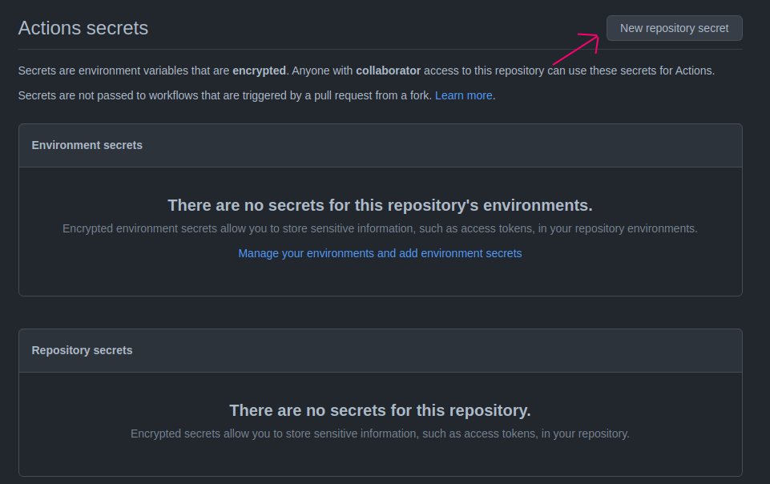
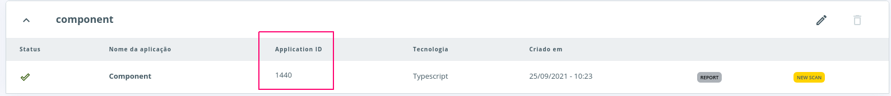

  

The Insider CI Action enables you to integrate the [insider.io](https://console.insidersec.io/) platform in your pipeline.

## Contents

- [Usage](#usage)
  - [Inputs](#inputs)
  - [Configure Insider Access in Github Secretes](#configure-insider-access-in-github-secretes)
  - [Get the Application Id](#get-the-application-id)

## Usage

Two basic examples of using the action are provided [here](https://github.com/ralvescosta/hackathon-insiderci-action/tree/main/sample-yml). 

### Inputs

Following inputs can be used as `steps.with` keys

| Name             | Type    | Required | Default   | Description                                                          |
|------------------|---------|----------|-----------|----------------------------------------------------------------------|
| `version`        | String  |  `false` |`latest`   | Insider CI version                                                   |
| `email`          | String  |  `true`  |           | Insider email                                                        |
| `password`       | String  |  `true`  |           | Insider password                                                     |
| `technology`     | String  |  `*`     |           | Specify which technology ruleset to load when not use application id |
| `applicationId`  | String  |  `*`     |           | Specify the insider application id                                   |
| `target`         | String  |  `false` |`.`        | Relative path under $GITHUB_WORKSPACE to use as a target             |
| `security`       | String  |  `false` |           | Set the Security level, values between 0 and 100                     |
| `noFail`         | Bool    |  `false` |           | Skip the security level validation                                   |

`*` One of this actions is required. You need to set `technology` or `applicationId`

### Configure Insider Access in Github Secretes

In your repositorio settings, acesses the secretes section

  

Before that configure your Insider email and password

  

### Get the Application Id

The application id is created when creating a component in an insider project in [insider](https://console.insidersec.io/).

  

